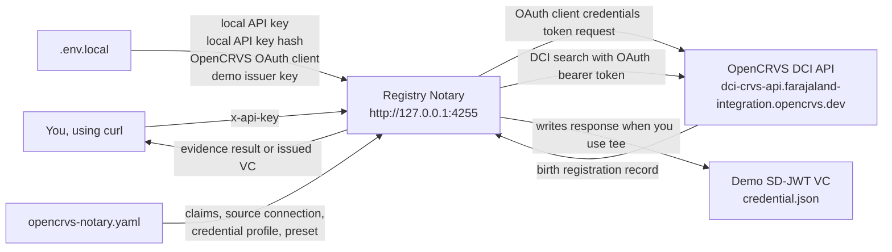
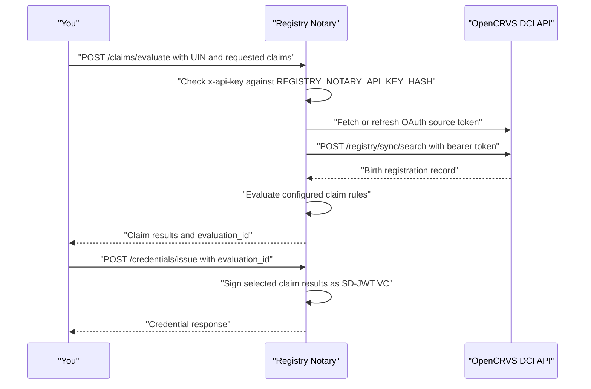

# OpenCRVS DCI Standalone Tutorial

This tutorial starts from zero: you want to get a `registry-notary` binary, run
it locally, connect it to the OpenCRVS DCI API, evaluate evidence, and issue a
demo SD-JWT VC.

The current standalone path is generated from Registry Notary's generic setup
features. OpenCRVS DCI is a packaged preset and tutorial path, not a special
runtime mode.

## What You Will Run

You will start Registry Notary locally:

```text
http://127.0.0.1:4255
```

Registry Notary will call OpenCRVS:

```text
https://dci-crvs-api.farajaland-integration.opencrvs.dev
```

You will test the generated evidence claim:

- `opencrvs-birth-record-exists`

Then you will issue a demo SD-JWT VC with:

```text
opencrvs_birth_summary_sd_jwt
```

This tutorial uses demo machine-to-machine issuance. It does not create a
citizen-wallet-bound credential.

## How The Pieces Fit Together

There are two HTTP relationships in this tutorial.

First, you call Registry Notary on your own machine. Registry Notary protects
that local API with an `x-api-key` header so only a caller with the generated
demo API key can ask it to evaluate evidence or issue a credential.

Second, Registry Notary calls OpenCRVS. The generated config uses generic
`source_auth.type = oauth2_client_credentials`, so Registry Notary exchanges
your OpenCRVS client id and client secret for source access tokens and refreshes
them when needed. You do not fetch or paste an OpenCRVS bearer token.

The shape looks like this:



Registry Notary is the translator. You ask it a claim question like "does a
birth record exist for this UIN?" Registry Notary turns that into an OpenCRVS
DCI search, reads the returned record, evaluates the configured claims, and can
package the selected claim results into a verifiable credential.

## Before You Start

Install:

- Docker Desktop is not required for this standalone tutorial
- Git
- Rust and Cargo, unless you already received a built binary
- OpenSSL, only if you are building dependencies that require it
- `curl`
- `jq`

Check:

```bash
git --version
cargo --version
openssl version
curl --version
jq --version
```

If you already received a built `registry-notary` binary, you can skip Step 1
after checking:

```bash
registry-notary --help
registry-notary init --help
registry-notary doctor --help
```

For this tutorial, the binary must support these generic features:

- `registry-notary init opencrvs-dci`
- `--env-file` on config-aware commands and server startup
- `registry-notary doctor`
- `registry-notary explain-config`
- `registry-notary hash-api-key`
- `registry-notary demo-issuer-key`
- `source_auth.type = oauth2_client_credentials`
- the `opencrvs_birth_dci` source preset

## Step 1: Get Registry Notary

The safest contributor path is to build Registry Notary from source. The build
expects three repositories beside each other:

```text
work/
  registry-notary/
  registry-platform/
  cel-mapping/
```

Create that layout:

```bash
mkdir -p work
cd work

git clone https://github.com/jeremi/registry-notary.git
git clone https://github.com/jeremi/registry-platform.git
git clone https://github.com/PublicSchema/crosswalk.git cel-mapping
```

If you received source folders instead of cloning from GitHub, unpack or rename
them so the folder names match the layout above.

Build the `registry-notary` command:

```bash
cd registry-notary
cargo build --release -p registry-notary-bin
export PATH="$PWD/target/release:$PATH"
registry-notary --help
```

Keep this terminal open. The `PATH` change applies only to this terminal.

## Step 2: Create A Working Folder

The working folder keeps the demo config, local secrets, and output credential
in one place. Nothing in this folder needs to be committed to Git.

```bash
mkdir -p "$HOME/opencrvs-notary-demo"
cd "$HOME/opencrvs-notary-demo"
```

Everything in this tutorial will live in this folder.

## Step 3: Generate The OpenCRVS Demo Files

Run the initializer:

```bash
registry-notary init opencrvs-dci --with-env-file --demo-issuer
```

The initializer writes the local starter files:

- `opencrvs-notary.yaml`
- `.env.local.example`
- `.env.local`
- `README.opencrvs-dci.md`, when the initializer includes generated notes

The generated `.env.local` contains local demo secrets such as the Registry
Notary API key, API key hash, audit hash secret, and demo issuer key. It leaves
the OpenCRVS client id and client secret as placeholders.

The command refuses to overwrite existing files unless you explicitly pass
`--force`.

## Step 4: Add OpenCRVS OAuth Client Values

Open `.env.local` and replace the OpenCRVS placeholders:

```dotenv
OPENCRVS_DCI_CLIENT_ID=paste-client-id-here
OPENCRVS_DCI_CLIENT_SECRET=paste-client-secret-here
```

Keep the file private:

```bash
chmod 600 .env.local
```

Do not add an `OPENCRVS_DCI_TOKEN`. Registry Notary obtains source tokens from
OpenCRVS by using the generated `source_auth` configuration.

## Step 5: Inspect The Generated Config

Use `explain-config` before starting the server:

```bash
registry-notary explain-config \
  --config opencrvs-notary.yaml \
  --env-file .env.local
```

The explanation should show required environment variable names, source
connections, claim-to-source wiring, credential profile links, and preset
expansion metadata. Secret values must be redacted.

The OpenCRVS source connection should have this generic shape:

```yaml
source_connections:
  opencrvs_birth_records:
    preset: opencrvs_birth_dci
    base_url: https://dci-crvs-api.farajaland-integration.opencrvs.dev
    source_auth:
      type: oauth2_client_credentials
      token_url: https://dci-crvs-api.farajaland-integration.opencrvs.dev/oauth2/client/token
      client_id_env: OPENCRVS_DCI_CLIENT_ID
      client_secret_env: OPENCRVS_DCI_CLIENT_SECRET
      request_format: json
```

The preset supplies the known OpenCRVS birth-record DCI defaults, such as
`search_path`, `registry_event_type: birth`, and `records_path`. Preset
expansion is generic: another registry preset should use the same expansion,
diagnostic, and source-auth paths.

## Step 6: Run Doctor

Run local checks first:

```bash
registry-notary doctor \
  --config opencrvs-notary.yaml \
  --env-file .env.local
```

Then run live checks:

```bash
registry-notary doctor \
  --config opencrvs-notary.yaml \
  --env-file .env.local \
  --live
```

`doctor --live` validates the OpenCRVS OAuth token flow and endpoint
reachability. It does not prove a specific citizen record exists unless you
provide a subject id.

If you have a test UIN from the OpenCRVS environment owner, run the record-level
probe:

```bash
registry-notary doctor \
  --config opencrvs-notary.yaml \
  --env-file .env.local \
  --live \
  --subject-id "$OPENCRVS_DEMO_SUBJECT_UIN" \
  --subject-id-type UIN
```

The subject id should be redacted or hashed in diagnostic output.

## Step 7: Start Registry Notary

Start the server with the same config and env file that passed `doctor`:

```bash
registry-notary \
  --config opencrvs-notary.yaml \
  --env-file .env.local
```

Leave this terminal running.

Open a second terminal in the same folder for the next steps.

## Step 8: Check That Registry Notary Is Running

The health check only proves the local process is up. It does not contact
OpenCRVS.

In the second terminal:

```bash
curl -fsS http://127.0.0.1:4255/healthz
```

Expected output:

```json
{"status":"ok"}
```

## Step 9: Choose A UIN To Test

Registry Notary needs a subject id to search for. In this tutorial the subject
id type is `UIN`, because the OpenCRVS DCI request is configured to search
birth records by UIN.

Use a UIN from the OpenCRVS test environment owner:

```bash
export OPENCRVS_DEMO_SUBJECT_UIN='<known test UIN>'
```

Confirm that a value was loaded without printing it:

```bash
test -n "$OPENCRVS_DEMO_SUBJECT_UIN" && echo "Demo UIN loaded"
```

If you do not have a UIN, `doctor --live` can still validate OAuth and endpoint
reachability, but evidence evaluation and VC issuance need a real seeded test
record.

Load only the generated local API key for curl calls:

```bash
REGISTRY_NOTARY_API_KEY="$(
  awk -F= '$1 == "REGISTRY_NOTARY_API_KEY" { print $2 }' .env.local |
    tr -d "'\""
)"
```

Do not print the API key.

## Step 10: Evaluate OpenCRVS Evidence

This is the first end-to-end evidence check. Your curl request goes to Registry
Notary, not directly to OpenCRVS. Registry Notary authenticates your local API
key, obtains or reuses an OpenCRVS source token, builds the OpenCRVS DCI search
request, reads the birth record, evaluates the configured birth-record-exists
claim, and returns the claim value.

The evaluate and issue calls follow this sequence:



```bash
curl -fsS -X POST http://127.0.0.1:4255/claims/evaluate \
  -H "x-api-key: $REGISTRY_NOTARY_API_KEY" \
  -H "content-type: application/json" \
  -H "data-purpose: https://demo.example.gov/purpose/opencrvs-dci-standalone" \
  -d "$(jq -nc --arg subject "$OPENCRVS_DEMO_SUBJECT_UIN" '{
    subject: { id: $subject, id_type: "UIN" },
    claims: ["opencrvs-birth-record-exists"],
    disclosure: "value",
    format: "application/vnd.registry-notary.claim-result+json"
  }')" | jq .
```

You should see one result:

```json
"claim_id": "opencrvs-birth-record-exists",
"value": true
```

## Step 11: Create An Evaluation For VC Issuance

VC issuance requires an evaluation whose format is `application/dc+sd-jwt`.
This step creates that evaluation and keeps its `evaluation_id`. The next step
uses the id so Registry Notary can issue from a specific evaluated result rather
than from a fresh, ambiguous request.

```bash
export EVAL_ID="$(
  curl -fsS -X POST http://127.0.0.1:4255/claims/evaluate \
    -H "x-api-key: $REGISTRY_NOTARY_API_KEY" \
    -H "content-type: application/json" \
    -H "data-purpose: https://demo.example.gov/purpose/opencrvs-dci-standalone" \
    -d "$(jq -nc --arg subject "$OPENCRVS_DEMO_SUBJECT_UIN" '{
      subject: { id: $subject, id_type: "UIN" },
      claims: ["opencrvs-birth-record-exists"],
      disclosure: "value",
      format: "application/dc+sd-jwt"
    }')" |
    jq -r '.results[0].evaluation_id'
)"
```

Confirm:

```bash
test -n "$EVAL_ID" && echo "Evaluation created"
```

## Step 12: Issue The SD-JWT VC

This final request asks Registry Notary to package the evaluated claims into
the configured credential profile. The response contains the compact SD-JWT VC
and the disclosures needed to reveal the selected claim values.

```bash
curl -fsS -X POST http://127.0.0.1:4255/credentials/issue \
  -H "x-api-key: $REGISTRY_NOTARY_API_KEY" \
  -H "content-type: application/json" \
  -d "$(jq -nc --arg evaluation_id "$EVAL_ID" '{
    evaluation_id: $evaluation_id,
    credential_profile: "opencrvs_birth_summary_sd_jwt",
    format: "application/dc+sd-jwt",
    claims: ["opencrvs-birth-record-exists"],
    disclosure: "value"
  }')" |
  tee credential.json |
  jq '{
    credential_id,
    credential_profile,
    format,
    issuer,
    expires_at,
    disclosure_count: (.disclosures | length),
    has_credential: (.credential | type == "string")
  }'
```

Expected output:

```json
{
  "credential_id": "urn:ulid:...",
  "credential_profile": "opencrvs_birth_summary_sd_jwt",
  "format": "application/dc+sd-jwt",
  "issuer": "did:web:localhost",
  "expires_at": "...",
  "disclosure_count": 1,
  "has_credential": true
}
```

The full credential response is saved in:

```text
credential.json
```

Treat this file as sensitive demo data.

## Customizing Generated Values

You usually do not need these commands for the first run because
`init opencrvs-dci --with-env-file --demo-issuer` generates local material.
They are useful for rotation and custom setup.

Generate or hash a local Registry Notary API key:

```bash
registry-notary hash-api-key
printf '%s' "$REGISTRY_NOTARY_API_KEY" | registry-notary hash-api-key --stdin --hash-only
```

Generate a demo Ed25519 issuer key:

```bash
registry-notary demo-issuer-key
```

The demo issuer key is not an OpenCRVS credential. It signs the SD-JWT VC in
this tutorial so that you can prove the full issue flow locally.

## Troubleshooting

### `unknown command init`, `unknown command doctor`, Or `unknown command explain-config`

You are running a Registry Notary binary that is too old for this tutorial.

Fix: rebuild Registry Notary from Step 1, then make sure this command finds the
rebuilt binary:

```bash
which registry-notary
registry-notary --help
```

### Doctor Reports Missing OpenCRVS Client Values

Open `.env.local` and replace the placeholders:

```dotenv
OPENCRVS_DCI_CLIENT_ID=paste-client-id-here
OPENCRVS_DCI_CLIENT_SECRET=paste-client-secret-here
```

Then run:

```bash
registry-notary doctor \
  --config opencrvs-notary.yaml \
  --env-file .env.local \
  --live
```

### OpenCRVS Search Returns HTTP 400

This usually means the DCI request shape does not match the OpenCRVS
environment.

Run:

```bash
registry-notary explain-config \
  --config opencrvs-notary.yaml \
  --env-file .env.local
```

Check that the OpenCRVS source connection resolves the `opencrvs_birth_dci`
preset and includes `registry_event_type: birth` in the expanded DCI settings.

### `source.not_found`

This usually means the UIN was not found.

A common mistake is sending the literal placeholder:

```json
"id": "<known test UIN>"
```

That sends the text `<known test UIN>`, not a real UIN.

Fix: load a real UIN:

```bash
test -n "$OPENCRVS_DEMO_SUBJECT_UIN" && echo "Demo UIN loaded"
```

Then use the `jq --arg subject "$OPENCRVS_DEMO_SUBJECT_UIN"` examples above.

### `source.unavailable`

Possible causes:

- the OpenCRVS client id or client secret is wrong
- network access to OpenCRVS is unavailable
- the Registry Notary config is pointing at the wrong OpenCRVS base URL
- the OpenCRVS token endpoint changed

Run `doctor --live` before restarting the server:

```bash
registry-notary doctor \
  --config opencrvs-notary.yaml \
  --env-file .env.local \
  --live
```

Registry Notary refreshes OAuth source tokens automatically. You should not need
to fetch an OpenCRVS token manually or restart the process only because a source
token expired.

### Port 4255 Is Already In Use

Edit:

```yaml
server:
  bind: 127.0.0.1:4256
```

Then use port `4256` in the curl commands.

### Credential Issuance Fails With `evaluation.binding_mismatch`

Make sure the evaluation request used:

```json
"format": "application/dc+sd-jwt"
```

The JSON evidence format can be viewed by people, but VC issuance requires the
SD-JWT VC format.

### Credential Issuance Fails With Issuer Key Diagnostics

Run:

```bash
registry-notary doctor \
  --config opencrvs-notary.yaml \
  --env-file .env.local
```

If you intentionally removed the generated demo issuer key, generate a new
demo-only key:

```bash
registry-notary demo-issuer-key
```

Put the generated JWK in the env var named by the credential profile's
`issuer_key_env`.

## Security Notes

- This tutorial stores live OpenCRVS client credentials in `.env.local`.
- Do not store an OpenCRVS access token in `.env.local`; source OAuth is handled
  by Registry Notary.
- The generated issuer key is demo-only. Replace it before any real deployment.
- The VC profile uses `holder_binding.mode: none`. It proves issuance, but it
  does not prove wallet holder control.
- For citizen-wallet issuance, use `holder_binding.mode: did`, require
  proof-of-possession, and issue only after validating a holder proof such as
  `did:jwk`.
